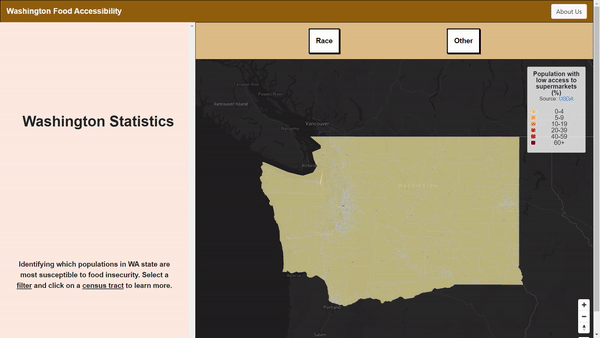

# Food Access Dashboard - Washington State 
### Visit our map [here](https://stpme.github.io/food-access-dashboard-wa/).

## Project Idea
Access to food is a fundamental need for every human being. However, there are areas and populations in the United States that have limited access to food, especially during the COVID-19 pandemic. This project aims to investigate the extent to which different minority groups are disproportionately affected by the issue of food access. By creating visualizations of food access conditions, we hope to raise public awareness and secure funding to help those in need across Washington state. We designed a food access dashboard that shows users which regions and which vulnerable populations are most affected by this phenomenon.

## Project Significance/Broader Impacts: 
Food deserts can be defined as a region where it is difficult to buy affordable, good-quality fresh food every day. Poor people and other vulnerable populations like minorities or seniors are often the most impacted due to cost of living or the lack of access to a vehicle. Recognizing these inequalities and highlighting which regions in Washington state is an important step towards providing these populations with better access or support in combatting food deserts.

## Methodology: 
We implemented interactive maps through QGIS and Mapbox that illustrate disparities in food access and to emphasize the prominence of food deserts in low-income and marginalized communities across the country. The dashboard contains filters to show different populations to allow for comparison across regions within Washington.

## Intended Audience: 
This data can be used by experts and policymakers to make decisions on providing and increasing access to affordable, healthy foods for these populations affected, which tend to be low-income or minorities. It can also be used by organizations and the general population to better identify food deserts and recognize if any community or social action can be done to provide support. We aim to emphasize and persuade our audience into taking actions and recognizing populations that have difficulties accessing affordable, high quality food in their area due to a variety of factors to enable them to take the first steps towards remedying this issue.

## Team Members: 
- Arsh Bath
- Johnny He
- Kyle Leung
- Jalen Sanders
- Mitchell Stapelman

## Data Sources & Libraries:
**Food desert dataset:** https://www.ers.usda.gov/data-products/food-access-research-atlas/download-the-data/
**County-level WA basemap:** https://ofm.wa.gov/washington-data-research/population-demographics/gis-data/census-geographic-files

**Libraries used:** Bootstrap, Mapbox GL JS

[Figma prototype](https://www.figma.com/proto/ZYLyTinyaJQfqvegUBtp6e/GEOG%3A-Design-Prototype?node-id=8-2&scaling=scale-down&page-id=0%3A1&starting-point-node-id=8%3A2)

## Acknowledgements:
Special thanks to our instructor: Professor Bo Zhao, and our teaching assistant: Steven Bao, for their support in providing resources and support with this project.